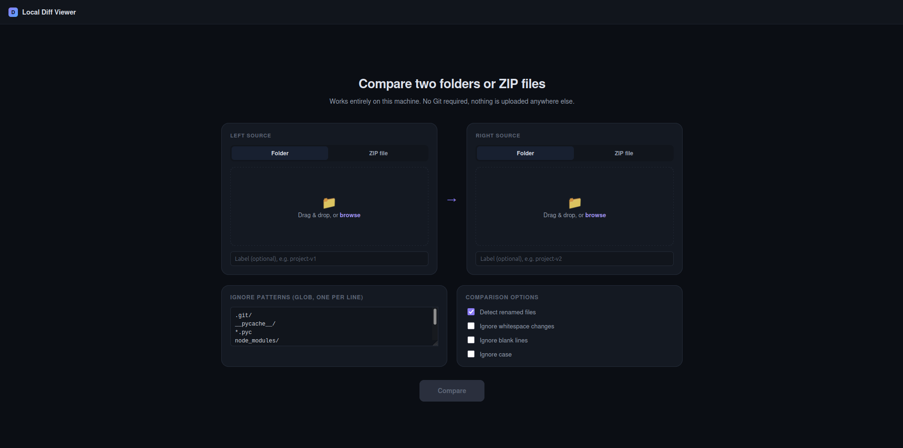

# Local Diff Viewer

A completely local **folder/ZIP comparison tool** with a `git diff`-style side-by-side
UI — without Git. Compare any combination of:

- Folder vs Folder
- ZIP vs ZIP
- Folder vs ZIP
- ZIP vs Folder



Everything runs on your machine. Nothing is uploaded to any external service; the
"upload" you see in the browser is just the browser sending your files to the local
Python server running on `127.0.0.1`.

---

## What it does

1. You pick a left source and a right source, each either a folder (via drag-and-drop
   or a folder picker) or a ZIP file.
2. The app scans both sides into a normalized manifest (relative path, size, SHA-256,
   text/binary classification), applying your ignore patterns.
3. It classifies every path as **added**, **deleted**, **modified**, **unchanged**, or
   **renamed** (renames are detected by exact content hash, and — for a bounded set of
   text files — by content similarity).
4. You get a summary, then a VS Code/GitHub-style explorer: a status-colored file tree
   on the left, and a side-by-side (or unified) line diff on the right, generated lazily
   only for the file you're viewing.
5. You can filter, search (filenames and file content), and export the whole comparison
   as JSON or as a **self-contained HTML report** that opens without the app running.

---

## Architecture

```
local-diff-viewer/
├── app/
│   ├── main.py                # FastAPI app factory
│   ├── core/
│   │   ├── scanner.py         # recursive folder -> manifest (dict[path, FileEntry])
│   │   ├── comparator.py      # manifest diffing, status classification, rename detection
│   │   ├── diff_engine.py     # line-level diff (difflib), side-by-side + unified
│   │   ├── diff_service.py    # lazy, on-demand FileDiff for one file (with size/line caps)
│   │   ├── file_detector.py   # text vs. binary detection (extension + content sniffing)
│   │   ├── hashing.py         # streaming SHA-256
│   │   ├── ignore_rules.py    # glob-style ignore pattern matching
│   │   └── tree_builder.py    # flat changes -> nested tree for the UI
│   ├── archive/
│   │   └── zip_handler.py     # safe ZIP extraction (Zip-Slip protected)
│   ├── models/                # plain dataclasses: FileEntry, FileChange, FileDiff, ...
│   ├── export/
│   │   ├── json_exporter.py
│   │   └── html_exporter.py   # standalone HTML report generator
│   └── web/
│       ├── routes.py          # all HTTP endpoints
│       ├── ingest.py          # turns uploads into a temp folder on disk
│       ├── session_store.py   # in-memory comparison sessions + temp-dir cleanup
│       ├── templates/index.html
│       └── static/{css,js}/
├── tests/                     # pytest: engine unit tests + API integration tests
├── test_data/                 # example project-v1 / project-v2 (+ matching .zip files)
├── requirements.txt
└── run.py
```

**Separation of concerns:** `core/` never imports anything from `web/` — it's a
plain, framework-free comparison engine you can use from a script or a different
UI entirely. `web/` is a thin FastAPI layer that turns HTTP requests into calls
into `core/`. Line-level diffs are deliberately **not** computed during the scan —
`comparator.py` only computes cheap metadata (hash, size) for the whole tree, and
`diff_service.py` generates the expensive line-by-line diff only for the one file
you click on.

---

## Requirements

- Python 3.10+
- No Git installation required
- No internet access required at runtime (all fonts/styles are system fonts, no CDN)

---

## Installation

```bash
python -m venv .venv
source .venv/bin/activate        # Windows: .venv\Scripts\activate
pip install -r requirements.txt
```

## Running locally

```bash
python run.py
```

Then open **http://localhost:8000**.

Options:
```bash
python run.py --port 8080          # different port
python run.py --host 0.0.0.0       # bind beyond localhost (not recommended)
python run.py --reload             # dev mode, auto-restarts on code changes
```

By default the server binds to `127.0.0.1` only, so nothing outside your machine
can reach it.

### Try it immediately

`test_data/project-v1` and `test_data/project-v2` (plus matching `.zip` files) are
included and exercise every change type: added, deleted, modified text, modified
binary, unchanged text, unchanged binary, a rename, a Unicode/space filename, and a
file excluded by the default ignore rules. Drop `project-v1` on the left and
`project-v2` on the right (or use the `.zip` files) and click **Compare**.

---

## How comparison works

For each side:
1. If it's a ZIP, it's safely extracted into a temp directory first (see
   **Security** below) — from that point on, folders and extracted ZIPs are treated
   identically.
2. The folder is walked recursively. Ignore rules are applied *during* the walk
   (ignored directories are pruned so the walk never descends into them — this
   matters for `node_modules/`-sized directories).
3. Every remaining file is streamed (not fully loaded into memory) through SHA-256,
   sampled for a text/binary decision, and recorded with its relative path and size.

The two manifests are then compared:
- Paths only on the left → **deleted**; only on the right → **added**.
- Paths on both sides with equal hash → **unchanged**; different hash → **modified**.
- Deleted/added pairs are checked for **renames**: first by exact hash match (pure
  move/rename), then — only when the candidate pool is small enough to stay cheap —
  by text-content similarity (`difflib.SequenceMatcher.quick_ratio`, threshold 0.6).

Line-level diffs are generated **on demand**, only for the file you open, using
`difflib.SequenceMatcher` (the same core algorithm behind `diff`/`git diff`, just
driven directly rather than via a subprocess).

---

## Supported inputs

- **Folder**: drag-and-drop a folder, or use the folder browse button
  (`<input webkitdirectory>`), on either side.
- **ZIP**: drag-and-drop a `.zip`, or browse for one. A dropped ZIP is auto-detected
  even if that side is still set to "Folder" mode.
- Any combination of the two on the left vs. the right.
- If everything in an upload lives under one single top-level folder (e.g. you zipped
  `myproject/`), that wrapper folder is stripped automatically so the comparison root
  matches what you'd expect from `git diff`.

---

## Ignore patterns

Enter one glob pattern per line in the **Ignore patterns** box. Defaults:

```
.git/
__pycache__/
*.pyc
node_modules/
.venv/
dist/
build/
*.log
.DS_Store
```

- A pattern ending in `/` matches a directory (anywhere in the tree) and everything
  under it, and is pruned during the scan (so ignoring `node_modules/` doesn't pay
  the cost of walking it).
- A pattern starting with `/` is anchored to the root of the source being scanned.
- Everything else is matched with `fnmatch` glob semantics against the file's
  relative path, its basename, and as a path segment.
- Comparison never uses file creation/modification/access timestamps or other OS
  metadata — only relative path, size, and content hash.

---

## Binary file handling

A file is treated as binary if either: its extension is on a known binary list
(`.png`, `.zip`, `.exe`, …), or — for anything else — a content sniff of the first
8&nbsp;KB finds a NUL byte or fails a UTF-8/printable-ratio check. Known text
extensions (`.py`, `.js`, `.md`, `.yaml`, …) skip the sniff as a fast path, but
**unrecognized extensions still get a fair content-based decision** rather than
being assumed binary.

Binary files are never diffed line-by-line. Instead you get:

```
Binary file changed
Left:  124 KB   sha256=abc123...
Right: 139 KB   sha256=def456...
```

plus an explicit "files are identical" / "files differ" indicator.

---

## Large files

- Files are hashed in streamed 1&nbsp;MiB chunks — never fully loaded into memory
  just to compute a hash.
- A line diff is only auto-generated when the two files' combined size is under
  3&nbsp;MB; above that, the UI shows a size warning with a **"Diff anyway"** button.
- Even when forced, a hard cap (60,000 combined lines) prevents pathological inputs
  (e.g. files with huge numbers of near-identical lines, a known `difflib` worst
  case) from blocking the server — you'll get a clear message instead of a hang.
- Unchanged runs of lines are collapsed by default (3 lines of context kept around
  each change), click to expand.

---

## Export

- **Export JSON** — the full comparison result (and, optionally, all modified/renamed
  file diffs) as a single JSON file.
- **Export HTML report** — a single, self-contained `.html` file (inlined CSS, no
  external requests) with the summary, the full file list, and detailed side-by-side
  diffs for modified/renamed text files (capped at 200 files per report to keep the
  file a reasonable size). Opens directly in any browser, no server required.

---

## Security considerations

- **Zip-Slip / path traversal**: every ZIP member path is resolved and checked to
  ensure it stays inside the extraction directory before anything is written;
  entries that would escape it raise an error and abort extraction
  (`app/archive/zip_handler.py`). The same check is applied to folder uploads
  (`app/web/ingest.py`), since a browser could in principle send a crafted relative
  path.
- **No code execution**: nothing extracted or uploaded is ever executed or imported.
- **No unsafe HTML rendering**: file content is always inserted as escaped text
  (both in the browser via `textContent`-safe escaping and in the exported HTML
  report via Python's `html.escape`), never as raw HTML.
- **Local-only network**: the server binds to `127.0.0.1` by default. No outbound
  network calls are made by the backend at any point.
- **Bounded resource usage**: upload item counts, per-diff line counts, and combined
  file sizes are all capped; sessions are stored in memory only and are evicted
  (oldest-first) past a small cap, with all temp directories cleaned up on session
  deletion and on process exit.

---

## Testing

```bash
pytest -q
```

Covers, at minimum: identical folders, added/deleted/modified/unchanged/renamed
files, binary changed/unchanged, folder-vs-ZIP and ZIP-vs-ZIP, ignore patterns,
empty and nested directories, ZIP path-traversal rejection, Unicode filenames and
filenames with spaces, LF vs. CRLF line endings, and large-file / pathological
line-count safety caps — both at the engine level (`tests/test_comparator.py`,
`tests/test_diff_engine.py`, `tests/test_zip_handler.py`, `tests/test_ignore_rules.py`)
and through the real HTTP API (`tests/test_api.py`).

---

## Extending it

The engine (`app/core/`) has no dependency on FastAPI or the web layer, so it's
straightforward to:
- Add a new export format (`app/export/`) — implement a function taking a
  `ComparisonResult` (+ optional `dict[str, FileDiff]`) and return your format.
- Swap the rename-detection heuristic in `comparator.py`.
- Change what counts as "text" in `file_detector.py`.
- Call `compare_sources()` directly from a script for a CLI or CI use case.

## Future improvements

- Virtualized rendering for extremely long diffs (currently the DOM holds the
  full visible diff; fine into the tens of thousands of rows, but a virtualized
  list would help beyond that).
- Syntax highlighting per file extension in the diff view.
- Persisting sessions to disk so a server restart doesn't lose an in-progress
  comparison.
- A CLI entry point (`python -m app.cli left right`) for scripting/CI usage
  without the web UI.
